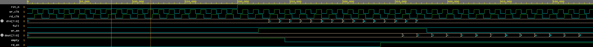

# Asynchronous FIFO (Verilog/SystemVerilog)

## 📌 Project Overview
This project implements an **asynchronous FIFO** (First-In First-Out) buffer in synthesizable Verilog/SystemVerilog, along with a **self-checking testbench**.  
The FIFO has:
- **8-bit data width** (`DATA_W=8`)  
- **Configurable depth** (default `DEPTH=16`, must be a power of two)  
- Independent **write clock** (`wr_clk`) and **read clock** (`rd_clk`)  
- **Active-low asynchronous reset** (`rst_n`)  

It demonstrates **safe clock domain crossing** using:
- **Gray-coded pointers** for write/read positions  
- **Two-flop synchronizers** to transfer Gray pointers across domains  
- Correct **full/empty detection** using the extra MSB trick  

**🔗 Try it on EDA Playground: [Async FIFO Project](https://www.edaplayground.com/x/ZjCW/)**

---

## 🛠️ RTL Features
- **Module:** `async_fifo.sv`  
- **Ports:**  
  - Write side: `wr_clk`, `wr_en`, `din[7:0]`, `full`  
  - Read side:  `rd_clk`, `rd_en`, `dout[7:0]`, `empty`  
- **Registered outputs:** `dout` is valid one `rd_clk` after a successful read.  
- **Flags:** `full` and `empty` are mutually exclusive (never both 1).  

---

## 🧪 Testbench
- **Module:** `tb_async_fifo.sv`  
- Generates independent write/read clocks (`100 MHz` and ~`71 MHz`).  
- Holds reset low for 200 ns, then releases.  
- **Deterministic sequence:**  
  - Writes exactly `DEPTH` values (`0..DEPTH-1`) into FIFO.  
  - Reads them back out after pointer synchronization.  
- **Reference model:** Uses a SystemVerilog queue (`q[$]`) to track expected values.  
- **Checker:** Compares `dout` against expected data one cycle after each read.  
- Reports `STATUS: PASS` if no mismatches are found.  

---

## ▶️ How to Run on EDA Playground
1. Open [EDA Playground](https://edaplayground.com).  
2. Create two files:  
   - `async_fifo.sv` (RTL)  
   - `tb_async_fifo.sv` (testbench)  
3. Set **Language:** *SystemVerilog/Verilog*.  
4. Set **Top Module:** `tb_async_fifo`.  
5. Set **Simulator:** *Siemens Questa*.  
6. Run.  
7. For waveforms:  
   - Ensure testbench contains:
     ```systemverilog
     initial begin
       $dumpfile("dump.vcd");
       $dumpvars(0, tb_async_fifo);
     end
     ```  
   - Check "Open EPWave after run"

---

## 📊 What to Look For in Waveforms
- After reset: `empty=1`, `full=0`.  
- During write phase:  
  - `wr_en` pulses, `din` increments, `empty` drops to 0.  
- During read phase:  
  - `rd_en` pulses, `dout` outputs incrementing values `0..DEPTH-1`.  
  - `empty` rises back to 1 after final read.  
- At no point should `full` and `empty` both be 1.  

---

## ✅ Expected Output
At the end of simulation, console log shows something like:

```
===============================================
Writes: 16  Reads: 16  Errors: 0  QueueRem: 0  full=0 empty=1
STATUS: PASS
===============================================
```

## 📈 Waveform
